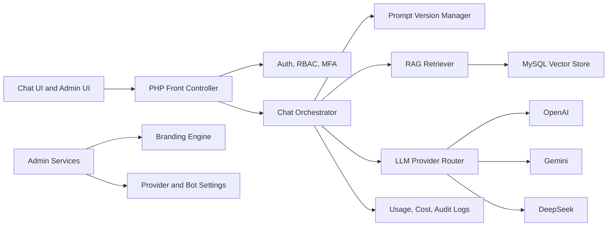

# AI Integrated Chatbot Portal

AI Integrated Chatbot Portal is a secure PHP 8.3 and MySQL 8 platform for institutional chatbot deployments. It provides a multi-provider LLM gateway, retrieval-augmented generation, prompt versioning, dynamic branding, analytics, and an administration layer designed for controlled rollout across departments.

## Key Capabilities

| Area | Capability |
| --- | --- |
| Multi-LLM gateway | Route requests to OpenAI, Gemini, or DeepSeek with provider health checks, fallback, timeout budgets, and per-group defaults |
| Intent-aware routing | Classify user intent and adapt provider order, sampling settings, RAG use, and output budget per request |
| Prompt firewall | Detect prompt extraction, secret requests, data exfiltration attempts, and unsafe administrative actions before provider calls |
| Chat experience | Responsive Tailwind-based chat UI, markdown-safe rendering, source citations, latency display, session history, and model transparency |
| RAG knowledge base | Upload TXT, PDF, and DOCX sources, chunk content, create embeddings, store vectors in MySQL, retrieve cited context, and track document provenance |
| Prompt operations | Versioned system prompts, personas, release notes, approval workflow, rollback, and A/B experiment metadata |
| Evaluation lab | JSON evaluation packs and CLI runner for prompt, RAG, refusal, citation, and policy behavior checks |
| Administration | RBAC for super admins, department admins, reviewers, and end users with scoped permissions |
| Branding | Dashboard-managed logo, palette, typography, support links, and dynamic CSS variables without code edits |
| Security | MFA-ready admin accounts, encrypted provider credentials, CSRF protection, rate limiting, audit logging, retention controls, and secure headers |
| Governance | Interaction logging, cost tracking, token analytics, provider uptime, moderation flags, data residency controls, and configurable retention windows |
| Operations | Docker Compose stack, health endpoint, CI syntax validation, migration SQL, and deployment hardening guidance |

## Architecture



## Repository Structure

| Path | Purpose |
| --- | --- |
| `public/` | Front controller and frontend assets |
| `src/AI/` | Provider abstraction, fallback routing, and chat orchestration |
| `src/Rag/` | Document extraction, chunking, embeddings, vector retrieval, and citations |
| `src/Security/` | RBAC, MFA, CSRF, rate limiting, encryption, and audit helpers |
| `src/Admin/` | Branding, prompt, provider, and configuration services |
| `src/Analytics/` | Token, cost, latency, and uptime recording |
| `database/schema.sql` | MySQL 8 schema for users, chats, RAG, prompts, analytics, and audit logs |
| `docs/` | Architecture, security, API, RAG, and deployment guidance |

## Quick Start

```bash
cp .env.example .env
docker compose up --build
```

Open the portal at <http://localhost:8080>.

Run local checks:

```bash
php scripts/lint.php
php scripts/run-evaluation.php
```

## Configuration Highlights

```env
APP_ENV=local
APP_KEY=base64:replace-with-32-byte-sodium-key
DB_HOST=mysql
DB_DATABASE=ai_chatbot_portal
OPENAI_API_KEY=
GEMINI_API_KEY=
DEEPSEEK_API_KEY=
DEFAULT_PROVIDER=openai
DATA_RESIDENCY_REGION=UAE
AUDIT_RETENTION_DAYS=365
```

Provider keys are encrypted before storage. Environment variables may be used for local development, but production should use the encrypted `provider_credentials` table or a managed secret store.

## Security Model

- Admin routes require authenticated sessions, CSRF validation, MFA enrollment, and RBAC checks.
- Provider credentials are encrypted with sodium secretbox using `APP_KEY`.
- All administrative changes are written to append-only audit logs.
- Chat requests are rate-limited by user, IP, provider, and bot instance.
- Prompt versions are immutable once approved, enabling rollback and post-incident review.
- Knowledge-base documents keep provenance metadata so generated answers can cite source chunks.

## Core Workflows

1. Super admin configures provider credentials and fallback order.
2. Department admin creates a bot instance with persona, prompt version, model settings, and branding.
3. Knowledge manager uploads documents for indexing.
4. End users chat with the bot through a branded interface.
5. The orchestrator retrieves relevant context, routes the request to the selected provider, records usage, and returns cited answers.
6. Analytics dashboards show token spend, provider uptime, latency, flagged conversations, and RAG hit rates.

## Documentation

- [Architecture](docs/architecture.md)
- [Security Model](docs/security-model.md)
- [RAG Pipeline](docs/rag-pipeline.md)
- [Innovation Layer](docs/innovation-layer.md)
- [Evaluation Lab](docs/evaluation-lab.md)
- [API Reference](docs/api.md)
- [Deployment Guide](docs/deployment.md)
- [Operations Runbook](docs/operations-runbook.md)

## Roadmap

- SSO integration with SAML/OIDC.
- Human-review queues for flagged conversations.
- Department-level cost budgets and hard stops.
- Evaluation harness for prompt and model regression testing.
- Live SSE streaming with provider-specific adapters.
- Optional managed vector database adapters.

## License

MIT License. See [LICENSE](LICENSE).
