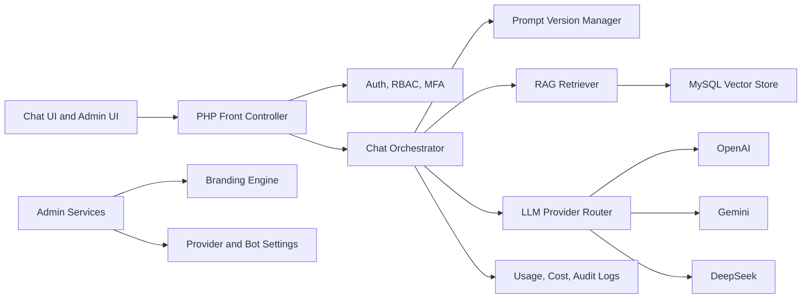

# AI Integrated Chatbot Portal

AI Integrated Chatbot Portal is a secure PHP 8.3 and MySQL 8 platform for institutional chatbot deployments. It provides a multi-provider LLM gateway, retrieval-augmented generation, prompt versioning, dynamic branding, analytics, and an administration layer designed for controlled rollout across departments.

## Key Capabilities

| Area | Capability |
| --- | --- |
| Multi-LLM gateway | Route requests to OpenAI, Gemini, or DeepSeek with provider health checks, fallback, timeout budgets, and per-group defaults |
| Intent-aware routing | Classify user intent and adapt provider order, sampling settings, RAG use, and output budget per request |
| Prompt firewall | Detect prompt extraction, secret requests, data exfiltration attempts, and unsafe administrative actions before provider calls |
| Chat experience | Modern operations-console UI with compact navigation, quick prompts, live safety/routing signals, usage telemetry, and source citations |
| RAG knowledge base | Upload TXT, PDF, and DOCX sources, chunk content, create embeddings, store vectors in MySQL, retrieve cited context, and track document provenance |
| RAG freshness audit | Review source ownership, review dates, citation requirements, and stale indexes before release |
| Knowledge-base access scope audit | Gate RAG collections by bot, department, classification, retrieval scope, citation requirement, personal-data approval, and review date |
| RAG citation integrity audit | Check whether answer claims cite retrieved, approved, current, high-score, and citation-allowed sources |
| RAG source retirement | Runbook for retiring, replacing, restricting, re-owning, or quarantining knowledge-base sources while preserving citation and audit history |
| Prompt operations | Versioned system prompts, personas, release notes, approval workflow, rollback, and A/B experiment metadata |
| Prompt release audit | Gates prompt and persona releases for approval, evaluation, red-team, rollback, RAG freshness, tool-policy, and human-review evidence |
| Evaluation lab | JSON evaluation packs and CLI runner for prompt, RAG, refusal, citation, and policy behavior checks |
| Evaluation coverage gate | Audits scenario packs for required safety, citation, policy, credential, and research coverage before release |
| Prompt injection regression audit | Checks release-blocking prompt-injection packs for direct, indirect, extraction, RAG poisoning, tool abuse, and credential-safety coverage |
| Human review queue audit | Release and closure gate for high-risk chatbot conversations, reviewer assignment, SLA, redaction, escalation, evidence hashes, and version context |
| Administration | RBAC for super admins, department admins, reviewers, and end users with scoped permissions |
| Admin activity evidence audit | Governance gate for exported prompt, provider, RAG, RBAC, branding, cost, retention, and decommissioning changes |
| Tool invocation policy audit | Release gate for chatbot tool permissions, high-impact actions, human approval, logging, credential scope, rollback, and emergency stop readiness |
| Branding | Dashboard-managed logo, palette, typography, support links, and dynamic CSS variables without code edits |
| Security | MFA-ready admin accounts, encrypted provider credentials, CSRF protection, rate limiting, audit logging, retention controls, and secure headers |
| Prompt log minimization | Pre-persistence redaction for emails, identifiers, tokens, API keys, phone numbers, and long secret-like values |
| Audit export | Redacted evidence packages with package-level SHA-256 integrity checks for conversation review |
| Redaction assurance | Residual scan for unredacted tokens, API keys, JWT-like values, emails, and direct identifiers before evidence sharing |
| Provider incident evidence | Redacted, hashable packages for provider degradation, fallback routing, cost spikes, and safety-filter changes |
| Provider failover readiness | Pre-release audit for fallback provider order, health checks, timeout/retry limits, residency and safety equivalence, logging, runbook, and evidence |
| Provider data processing review | Review provider data categories, training use, retention, subprocessors, regions, deletion, assurance evidence, fallback eligibility, and portal configuration controls |
| Cost budget audit | Department and bot-level cost guardrail for projected spend, hard stops, owner review, and approval evidence |
| Bot decommissioning | Runbook for retiring chatbot instances while preserving required evidence, removing access, handling RAG sources, revoking credentials, and closing audit records |
| Governance | Interaction logging, cost tracking, token analytics, provider uptime, moderation flags, data residency controls, and configurable retention windows |
| Operations | Docker Compose stack, health endpoint, CI syntax validation, migration SQL, and deployment hardening guidance |

## Architecture



## Repository Structure

| Path | Purpose |
| --- | --- |
| `public/` | Front controller and frontend assets |
| `src/AI/` | Provider abstraction, fallback routing, and chat orchestration |
| `src/Rag/` | Document extraction, chunking, embeddings, vector retrieval, and citations |
| `src/Security/` | RBAC, MFA, CSRF, rate limiting, encryption, and audit helpers |
| `src/Admin/` | Branding, prompt, provider, and configuration services |
| `src/Analytics/` | Token, cost, latency, and uptime recording |
| `database/schema.sql` | MySQL 8 schema for users, chats, RAG, prompts, analytics, and audit logs |
| `docs/` | Architecture, security, API, RAG, and deployment guidance |

## Quick Start

```bash
cp .env.example .env
docker compose up --build
```

Open the portal at <http://localhost:8080>.

Run local checks:

```bash
php scripts/lint.php
php scripts/run-evaluation.php
php scripts/evaluation-coverage-gate.php
php scripts/prompt-injection-regression-audit.php
php scripts/rag-freshness-audit.php
php scripts/check-security-headers.php
php scripts/provider-incident-evidence.php
php scripts/provider-failover-readiness.php
php scripts/prompt-release-audit.php
php scripts/human-review-queue-audit.php
php scripts/admin-activity-evidence-audit.php
php scripts/tool-invocation-policy-audit.php
php scripts/cost-budget-audit.php
php scripts/prompt-log-redaction-preview.php
php scripts/redaction-residual-audit.php
php scripts/kb-access-scope-audit.php
php scripts/rag-citation-integrity-audit.php
```

## Configuration Highlights

```env
APP_ENV=local
APP_KEY=base64:replace-with-32-byte-sodium-key
DB_HOST=mysql
DB_DATABASE=ai_chatbot_portal
OPENAI_API_KEY=
GEMINI_API_KEY=
DEEPSEEK_API_KEY=
DEFAULT_PROVIDER=openai
DATA_RESIDENCY_REGION=UAE
AUDIT_RETENTION_DAYS=365
```

Provider keys are encrypted before storage. Environment variables may be used for local development, but production should use the encrypted `provider_credentials` table or a managed secret store.

## Security Model

- Admin routes require authenticated sessions, CSRF validation, MFA enrollment, and RBAC checks.
- Provider credentials are encrypted with sodium secretbox using `APP_KEY`.
- All administrative changes are written to append-only audit logs.
- Chat requests are rate-limited by user, IP, provider, and bot instance.
- Prompt versions are immutable once approved, enabling rollback and post-incident review.
- Knowledge-base documents keep provenance metadata so generated answers can cite source chunks.

## Core Workflows

1. Super admin configures provider credentials and fallback order.
2. Department admin creates a bot instance with persona, prompt version, model settings, and branding.
3. Knowledge manager uploads documents for indexing.
4. End users chat with the bot through a branded interface.
5. The orchestrator retrieves relevant context, routes the request to the selected provider, records usage, and returns cited answers.
6. Analytics dashboards show token spend, provider uptime, latency, flagged conversations, and RAG hit rates.

## Documentation

- [Architecture](docs/architecture.md)
- [Security Model](docs/security-model.md)
- [RAG Pipeline](docs/rag-pipeline.md)
- [RAG Freshness Audit](docs/rag-freshness-audit.md)
- [Knowledge-Base Access Scope Audit](docs/kb-access-scope-audit.md)
- [RAG Citation Integrity Audit](docs/rag-citation-integrity-audit.md)
- [RAG Source Retirement Runbook](docs/rag-source-retirement-runbook.md)
- [Innovation Layer](docs/innovation-layer.md)
- [Evaluation Lab](docs/evaluation-lab.md)
- [Evaluation Coverage Gate](docs/evaluation-coverage-gate.md)
- [Prompt Injection Regression Audit](docs/prompt-injection-regression-audit.md)
- [Human Review Queue Audit](docs/human-review-queue-audit.md)
- [Admin Activity Evidence Audit](docs/admin-activity-evidence-audit.md)
- [Tool Invocation Policy Audit](docs/tool-invocation-policy-audit.md)
- [Conversation Audit Export](docs/conversation-audit-export.md)
- [Redaction Residual Audit](docs/redaction-residual-audit.md)
- [Provider Incident Evidence](docs/provider-incident-evidence.md)
- [Provider Failover Readiness](docs/provider-failover-readiness.md)
- [Provider Data Processing Review](docs/provider-data-processing-review.md)
- [Prompt Release Audit](docs/prompt-release-audit.md)
- [Bot Decommissioning Runbook](docs/bot-decommissioning-runbook.md)
- [Cost Budget Audit](docs/cost-budget-audit.md)
- [Prompt Log Redaction](docs/prompt-log-redaction.md)
- [API Reference](docs/api.md)
- [Deployment Guide](docs/deployment.md)
- [Operations Runbook](docs/operations-runbook.md)

## Roadmap

- SSO integration with SAML/OIDC.
- Runtime human-review queues for flagged conversations.
- Department-level cost budget enforcement in runtime routing.
- Evaluation harness for prompt and model regression testing.
- Live SSE streaming with provider-specific adapters.
- Optional managed vector database adapters.

## License

MIT License. See [LICENSE](LICENSE).
